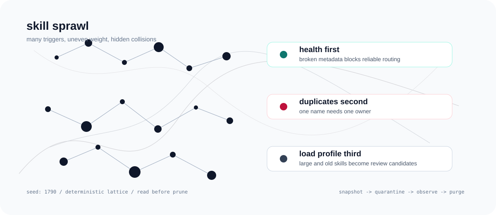
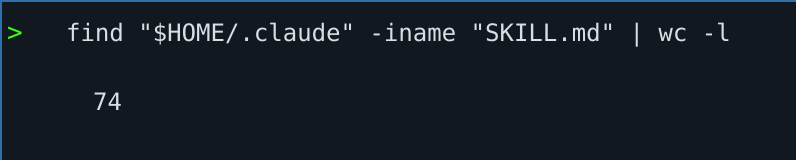
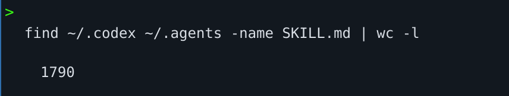

# Skill Library Pruner

A read-first, reversible cleanup skill for agent skill libraries that got too big.

Agent skills are useful. But when your library grows past the point where you can
name what is installed, you need a process - not a hunch.



This skill helps an agent answer:

- What skills do I have?
- Which ones collide?
- Which ones are stale?
- Which ones are broken?
- Which ones can be quarantined without deleting them?

## Quickstart (30-second setup)

Install the skill:

```bash
npx skills@latest add Trkzi-Omar/prune-skills \
  --skill skill-library-pruner \
  --agent claude-code
```

Then ask your agent:

```text
Use skill-library-pruner to audit my skills. Do not quarantine or delete anything yet.
```

The first run should be read-only. It should inventory your skills, show duplicate
names, report health problems, and explain what it would prune before touching
anything.

If you run the scripts manually, start with all known agent roots:

```bash
bash scripts/audit.sh --all-agents
bash scripts/usage.sh --all-agents --days 7
```

`usage.sh` scans the same log history window as `--days` by default. For a
slower exhaustive scan, add `--log-history-days 0`.

If the scanned transcripts contain no explicit skill-use markers, the report
stops and says there is no usable signal instead of implying every skill is
unused.

## Why This Exists

I built this because my skills directory got out of hand.

My Claude skills had already grown to 74 files:



Across Codex and local agent skill directories, the count had ballooned further:



At that scale, deleting by instinct is how you lose something you actually relied
on. The only acceptable workflow is:

1. Read before writing.
2. Snapshot before moving.
3. Quarantine before deleting.
4. Restore anything you miss.
5. Purge only after living without it.

## What It Does

The skill wraps three shell scripts:

- **`audit.sh`** - read-only inventory across Claude Code, Codex, shared agent,
  project, plugin, and extra skill roots. Leads with a concise summary, then
  reports duplicate names, loading-critical health issues, informational metadata
  notes, and large skills worth reviewing.
- **`usage.sh`** - read-only usage signal from Claude and Codex transcript logs.
  Looks for explicit `Using \`skill-name\`` markers, then shows stale skills and
  skills with no readable log hits.
- **`prune.sh`** - guarded mutation commands: `snapshot`, `quarantine`, `list`,
  `restore`, and `purge`.

The important part is the workflow. `usage.sh` does not prove a skill is unused.
It only gives you a triage signal. The skill should still quarantine first and
delete later.

## What The Audit Feels Like

The default audit output is meant to be read, not parsed. It starts with a small
snapshot, then tells you what to do next before showing details.

```text
============================================================================
 AGENT SKILL AUDIT
 Roots scanned:
   agent    : codex
 Skills found: 59
============================================================================

Snapshot
--------
  Skills           59
  Plugin skills    4
  Duplicate names  1
  Health issues    0
  Metadata notes   7
  SKILL.md lines   15264 total

Load profile
------------
  Large 400+     [####....................] 11
  Medium 150-399 [##########..............] 25
  Small <150     [#########...............] 23

Next actions
------------
  1. No loading-critical health issues found.
  2. Resolve duplicate names. Pick one owner per name before pruning.
  3. Review metadata notes only if a skill fails to load; many package layouts are intentional.
  4. Review large skills below as triage candidates, not delete orders.
  5. Use --age-table, --full-table, or --full-descriptions only for drill-down.
```

## Manual Script Usage

Inventory all known agent skill roots:

```bash
bash scripts/audit.sh --all-agents
```

Show fewer top candidates:

```bash
bash scripts/audit.sh --all-agents --limit 5
```

Show every skill in the inventory table:

```bash
bash scripts/audit.sh --all-agents --full-table
```

Show oldest modified dates as supporting context:

```bash
bash scripts/audit.sh --all-agents --age-table
```

Show full descriptions for trigger-overlap triage:

```bash
bash scripts/audit.sh --all-agents --full-descriptions
```

Inventory one agent preset:

```bash
bash scripts/audit.sh --agent codex
```

Check recent usage:

```bash
bash scripts/usage.sh --all-agents --days 7
```

Scan all readable logs instead of the recent default:

```bash
bash scripts/usage.sh --all-agents --days 7 --log-history-days 0
```

Snapshot a writable root:

```bash
bash scripts/prune.sh snapshot ~/.claude/skills
```

Quarantine a skill:

```bash
bash scripts/prune.sh quarantine ~/.claude/skills/some-skill
```

Restore it:

```bash
bash scripts/prune.sh restore some-skill
```

Dry-run purge:

```bash
bash scripts/prune.sh purge
```

Confirm purge:

```bash
bash scripts/prune.sh purge --yes
```

## Guardrails

- **No deletion on first pass.** Quarantine, observe, then purge.
- **No trust in weak signals.** "No log hits" means "not seen in readable logs",
  not "never used".
- **No touching protected paths.** The pruning script refuses system paths and
  anything outside `$HOME` or the current working directory.
- **No silent destructive action.** `purge` needs `--yes`.

## Local Development

List the skill from this checkout:

```bash
npx skills@latest add . --list --full-depth
```

Install from this checkout:

```bash
npx skills@latest add . \
  --skill skill-library-pruner \
  --agent claude-code
```

Run a syntax check:

```bash
bash -n scripts/audit.sh scripts/usage.sh scripts/prune.sh
```

Run the agent-aware smoke test:

```bash
bash tests/agent-aware-smoke.sh
```

## Summary

This is for when your skill library has become a ball of mud.

It does not try to be clever. It tries to be reversible.
